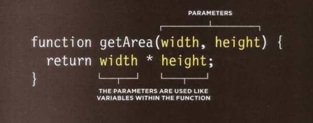
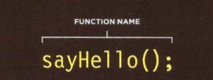

> # Functions

It allow the process of grouping a series of  statement  to perform a task.

By calling the function we are reducing the number of  statements  within the same page, this grouping process help organize the code once we open a page the line of code inside a function are not excuted in a way we are storing the statment that will perform a task.

if a function perform the task we can call it a gain no problem.

if you add information  once  you call the function the info called parameters.

once the function return values the  response  is known **return value**.

> Example of a function

> calling the Function 

