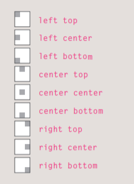

> # Images

Controling size of images in CSS

You can control the size of an
image using the width and
height properties in CSS, just
like you can for any other box. 

for Example
(img {
width: 500px;
height: 500px;})

> background-image

Ex:- background-image: url("images/pattern.gif"); 

 background-image property allows you to place an image behind any HTML element.

> background-repeat && background-attachment

The background-repeat
property can have four values:

repeat

The background image is
repeated both horizontally and
vertically.

repeat-x
The image is repeated
horizontally only.

repeat-y
The image is repeated vertically
only.

no-repeat
The image is only shown once.

The background-attachment
property specifies whether a
background image should stay in
one position or move as the user
scrolls up and down the page. It
can have one of two values:
- fixed
The background image stays in.
- scroll
The background image moves
up and down as the user scrolls
up and down the page.

>background-position

When an image is not being
repeated, you can use the
background-position property to specify where in the
browser window the background
image should be placed.

This property usually has a pair
of values. The first represents
the horizontal position and the
second represents the vertical.

