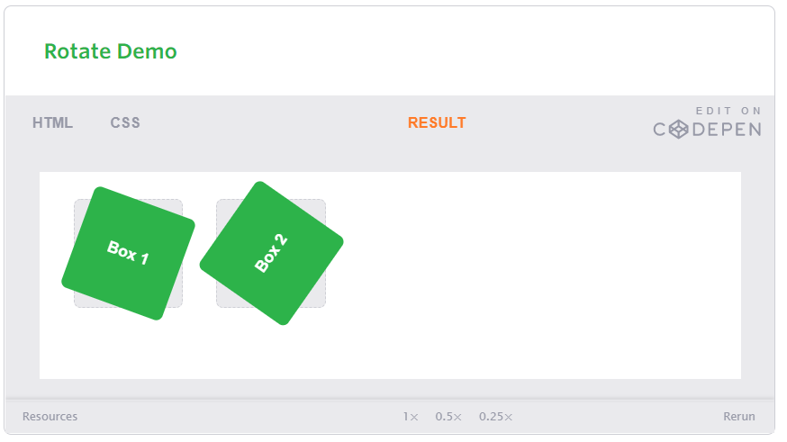
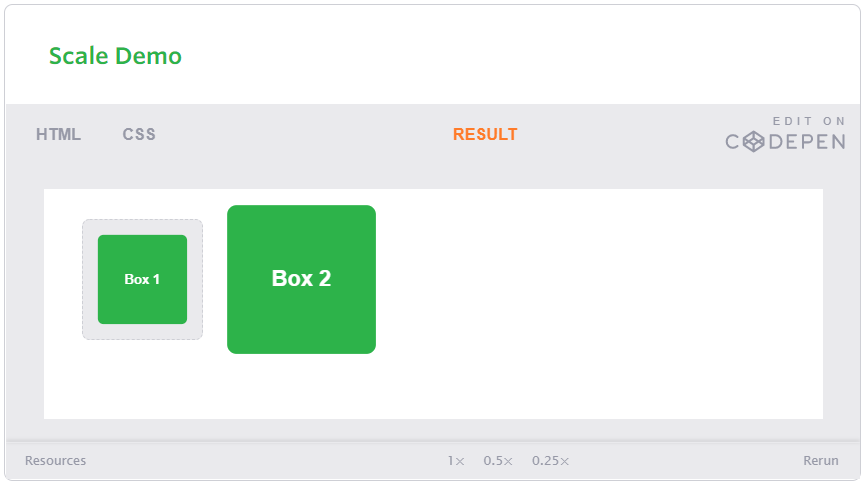
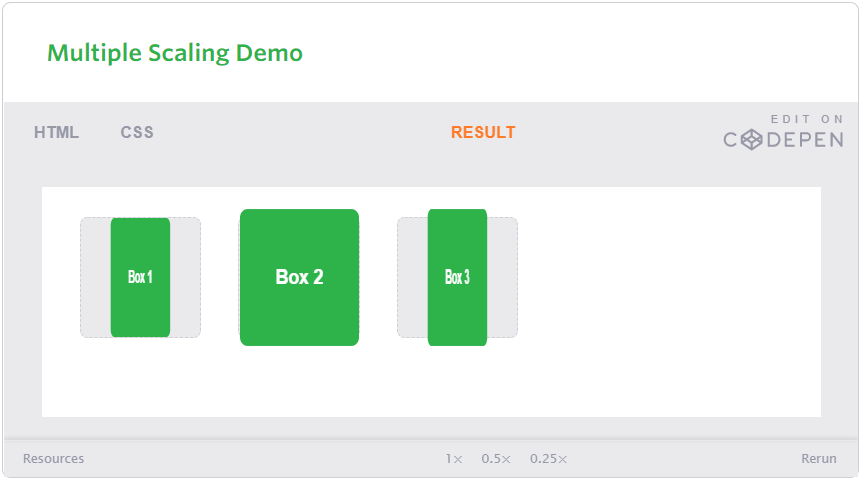

Working within a team requires a great effort. It is not easy to trust the team, but we can through practicing teamwork on an idea or project. By working on projects, the team's productivity is evaluated.

One of the most important elements that support the success of cooperative work is the homogeneity of the team together because the homogeneous team work makes the group tend to innovate faster and the teamwork enhances the process of discovering errors and enhances profitability. Companies must work to influence the style of teamwork and support it in order to increase profits.

In one of the experiments, the awareness of the team members was tested through a shopping list belonging to the team and with allowing the team members to buy some of their own needs, but to complete the purchase process for the needs of the team, they all have to sacrifice personal desires in exchange for what the team needs. I personally believe that a successful team is what members sacrifice. Against the public interest.

A successful team contains members who are equal in group talk during presenting their ideas and studies have shown that a team that is equal in ability to express ideas is a successful team, in contrast to the other. A team that is characterized by low productivity notes that there is one person who speaks all the time or a small group and not the whole team.

    ‘As long as everyone got a chance to talk, the team did well. But if only one person or a small group spoke all the time, the collective intelligence declined.’

> # Transfome

With CSS3 came new ways to position and alter elements. Now general layout techniques can be revisited with alternative ways to size, position, and change elements. All of these new techniques are made possible by the transform property.

The transform property comes in two different settings, two-dimensional and three-dimensional. Each of these come with their own individual properties and values.

> ## CSS

- Transform Syntax
- 2D Transforms
- Combining Transforms
- Transform Origin
- Perspective
- 3D Transforms
- Transform Style
- Backface Visibility

### Transform Syntax

 div {

  -webkit-transform: scale(1.5);

-moz-transform: scale(1.5);
     
-o-transform: scale(1.5);

transform: scale(1.5);

}

### 2D Transforms

Two-dimensional transforms work on the x and y axes, known as horizontal and vertical axes.

.box-1 {

  transform: rotate(20deg);

}

.box-2 {

  transform: rotate(-55deg);

}

Here is the result of the 2d rotate code 

### 2D Scale

Using the scale value within the transform property allows you to change the appeared size of an element. The default scale value is 1, therefore any value between .99 and .01 makes an element appear smaller while any value greater than or equal to 1.01 makes an element appear larger.

.box-1 {
  transform: scale(.75);
}

.box-2 {
  transform: scale(1.25);
}

Here is the result of the 2d Scale code

It is possible to scale only the height or width of an element using the scaleX and scaleY values. The scaleX value will scale the width of an element while the scaleY value will scale the height of an element. To scale both the height and width of an element but at different sizes, the x and y axis values may be set simultaneously. To do so, use the scale transform declaring the x axis value first, followed by a comma, and then the y axis value.

.box-1 {
  transform: scaleX(.5);
}

.box-2 {
  transform: scaleY(1.15);
}

.box-3 {
  transform: scale(.5, 1.15);
}

