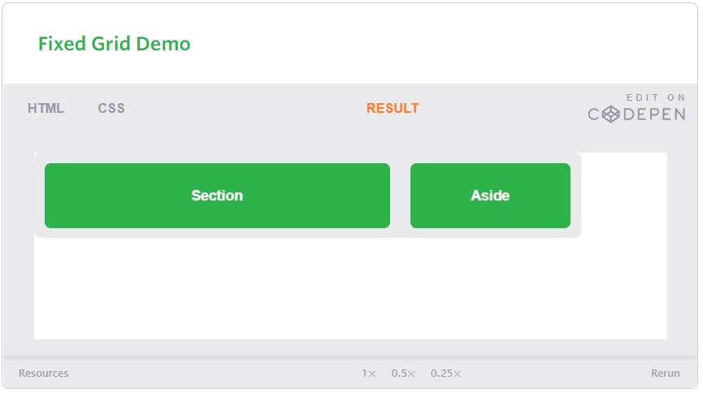
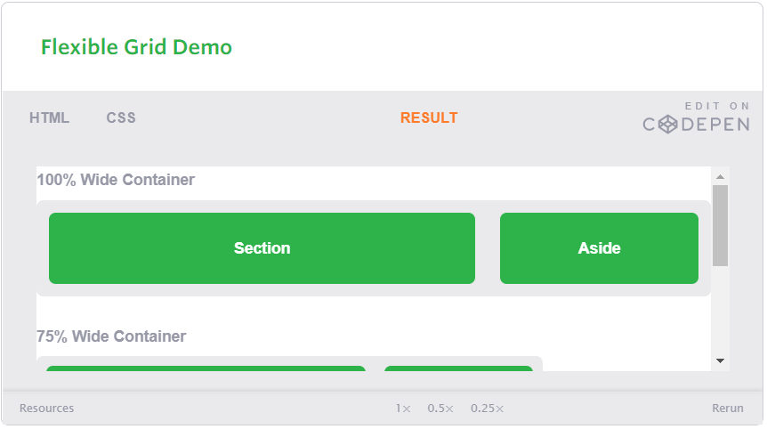

> # RESPONSIVE WEB DESIGN and FLOATS

## Responsive Web Design

The responsive web design term itself was coined, and largely developed, by Ethan Marcotte.

Responsive web design is the practice of building a website suitable to work on every device and every screen size, no matter how large or small, mobile or desktop.

> Responsive vs. Adaptive vs. Mobile

**Responsive:**

  Responsive generally means to react quickly and positively to any change, responsive design websites continually and fluidly change based on different factors, such as viewport width.

**Adaptive:**

  adaptive means to be easily modified for a new purpose or situation, such as change, adaptive websites are built to a group of preset factors.

**Mobile:**

  generally means to build a separate website commonly on a new domain solely for mobile users. While this does occasionally have its place, it normally isn’t a great idea. Mobile websites can be extremely light but they do come with the dependencies of a new code base and browser sniffing, all of which can become an obstacle for both developers and users.

  ---

Responsive web design is broken down into three main components, including flexible layouts, media queries, and flexible media.

> Flexible Layouts

flexible layouts, is the practice of building the layout of a website with a flexible grid.

instead of using regular px size we are using % sizing 

for example:

`
`

  `<section>...</section>`

  `<aside>...</aside>`
`
`

`.container {`

`  width: 538px;`

`}`

`section,`

`aside {`
  `margin: 10px;`

`}`

`section {`

  `float: left;`

  `width: 340px;`
`}`

`aside {`

  `float: right;`

  `width: 158px;`

`}`

ther result:

in the previous code we notic that the used px will remain fixed but with using the formula.

**target ÷ context = result**

`section,`

`aside {`

  `margin: 1.858736059%; /*  10px ÷ 538px = .018587361 */`

`}`

`section {`

  `float: left;`

  `width: 63.197026%;    /* 340px ÷ 538px = .63197026 */ `  
`}`

`aside {`

 ` float: right;`

 ` width: 29.3680297%;  /* 158px ÷ 538px = .293680297 */`

`}`

the result:

> ## Media Queries

Media queries were built as an extension to media types commonly found when targeting and including styles. Media queries provide the ability to specify different styles for individual browser and device circumstances, the width of the viewport or device orientation for example.

Initializing Media Queries

Generally speaking it is recommend to use the @media rule inside of an existing style sheet to avoid any additional HTTP requests.

Logical Operators in Media Queries

There are three different logical operators available for use within media queries, including and, not, and only.

Using the and logical operator within a media query allows an extra condition to be added, making sure that a browser or devices does both a, b, c, and so forth. Multiple individual media queries can be comma separated.

The example below selects all media types between 800 and 1024 pixels wide.

`@media all and (min-width: 800px) and (max-width: 1024px) {...}`

The not logical operator negates the query, specifying any query but the one identified. In the example below the expression applies to any device that does not have a color screen. Black and white or monochrome screens would apply here for example.

`@media not screen and (color) {...}`

The only logical operator is a new operator and is not recognized by user agents using the HTML4 algorithm, thus hiding the styles from devices or browsers that don’t support media queries. Below, the expression selects only screens in a portrait orientation that have a user agent capable of rending media queries.

`@media only screen and (orientation: portrait) {...}`

**Note:** When using the not and only logical operators the media type may be left off. In this case the media type is defaulted to all.

