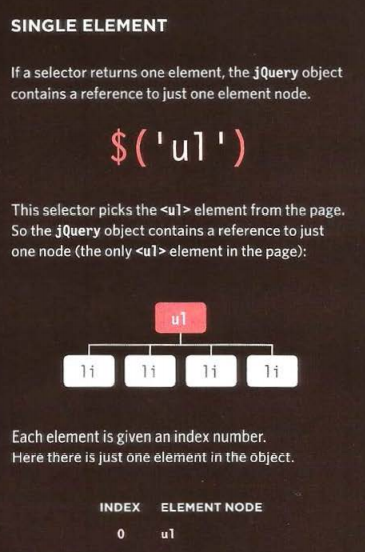
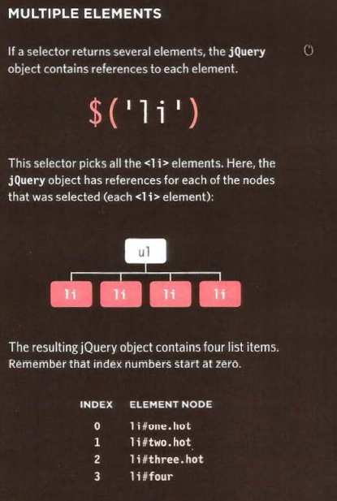

# jQuery

> What is jQuery?
W3shool defintion

jQuery is a lightweight, "write less, do more", JavaScript library.

The purpose of jQuery is to make it much easier to use JavaScript on your website.

jQuery takes a lot of common tasks that require many lines of JavaScript code to accomplish, and wraps them into methods that you can call with a single line of code.

WHY USE JQUERY?

jQuery doesn't do anything you cannot achieve with pure JavaScript. 
It is just a JavaScript file but estimates show it has been used on over a 
quarter of the sites on the web, because it makes coding simpler. 

> SIMPLE SELECTORS

Rather than learn a new way to select elements, 
jQuery uses a language that is already familiar to 
front-end web developers: CSS selectors. They: 
- Are much faster at selecting elements

- Can be a lot more accurate about which elements 
to select 

- Often require a lot less code than older DOM 
methods 

- Are already used by most front-end developers 
jQuery even adds some extra CSS-style selectors 
which offer additional functionality. 

>  COMMON TASKS IN LESS CODE

There are some tasks that front-end developers 
need to do regularly, such as loop through the 
elements that have been selected. 
jQuery has methods that offer web developers 
simpler ways to perform common tasks, such as: 
• loop through elements 
• Add I remove elements from the DOM tree 
• Handle events 
• Fade elements into I out of view 
• Handle Ajax requests 

jQuery's motto is "Write less, do more," because it allows you to achieve 
the same goals but in fewer lines of code than you would need to write 
with plain JavaScript. 

> CROSS-BROWSER COMPATIBILITY 

jQuery automatically handles the inconsistent ways 
in which browsers select elements and handle 
events, so you do not need to write cross-browser 
fallback code. 

to find element we should do this line for example :**($(li.hot))**

$(): jQury function

$(li.hot)): jQury object that finds li with class (.hot)

we can get information and set information for example

to get the infor form the html element we use a varible and set the value of the element inside the variable

`var content = $('li').html();`

on the other hand if we want to update the value of the element  we use it this way 

`$('li').html('Update');`

> ## 6 Reasons for Pair Programming

1. Greater efficiency.
1. Engaged collaboration.
1. Learning from fellow students.
1. Social skills.
1. Job interview readiness.

[Click Here for more reding](lab02b.md)