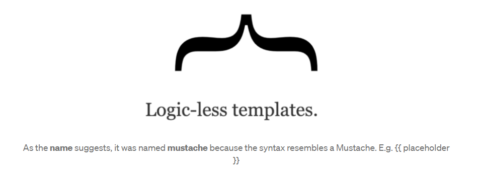
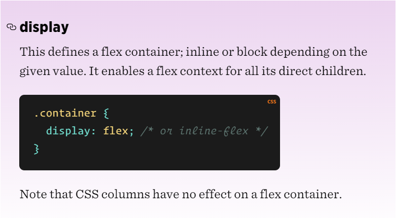
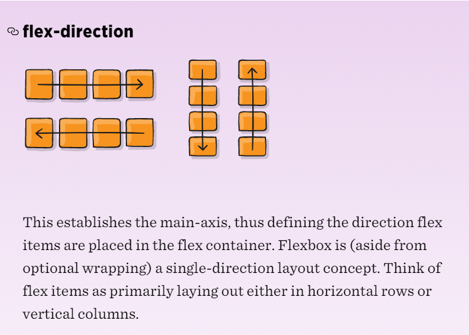
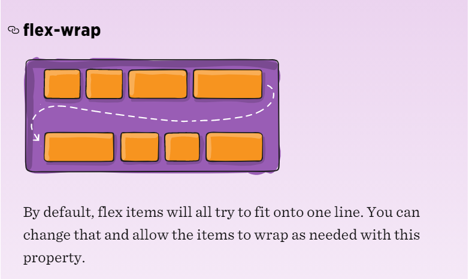

> # Readings: MUSTACHE and FLEXBOX

> ## Javascript Templating Language and Engine— Mustache.js with Node and Express

Javascript Templating

Javascript templating is a fast and efficient technique to render client-side view templates with Javascript by using a JSON data source.

 The template is HTML markup, with added templating tags that will either insert variables or run programming logic.

The template engine then replaces variables and instances declared in a template file with actual values at runtime, and convert the template into an HTML file sent to the client.

> Mustache

Mustache is a logic-less template syntax. It can be used for HTML, config files, source code — anything. It works by expanding tags in a template using values provided in a hash or object.

It is often referred to as “logic-less” because there are no if statements, else clauses, or for loops. Instead, there are only tags. 

Some tags are replaced with a value, some nothing, and others a series of values.

mustache.js is an implementation of the mustache template system in JavaScript. It is often considered the base for JavaScript templating.

 And, since mustache supports various languages, we don’t need a separate templating system on the server side.

 for example 

   `Mustache.render(“Hello, {{name}}”, { name: “Sherlynn” });`
    `// returns: Hello, Sherlynn`

In the above, we see two braces around {{ name }}. This is Mustache syntax to show that it is a placeholder. When Mustache compiles this, it will look for the ‘name’ property in the object we pass in, and replace {{ name }} with the actual value, e,g, “Sherlynn”.

> ## Mustache-Express

If you intend you use mustache with Node and Express, you can use mustache-express. Mustache Express lets you use Mustache and Express together easily.

To install:

With Yarn:

`$ yarn add mustache-express`

or with NPM:

`$ npm install mustache --save`

`Mustache.render(“Hello, {{name}}”, { name: “Sherlynn” });`
`// returns: Hello, Sherlynn`

Mustache coding is the best way to reduce the coding of java script.

> # Guide to Flexbox

The main idea behind the flex layout is to give the container the ability to alter its items’ width/height (and order) to best fill the available space (mostly to accommodate to all kind of display devices and screen sizes). A flex container expands items to fill available free space or shrinks them to prevent overflow.

`.container { flex-direction: row | row-reverse | column | column-reverse;
}`

- row (default): left to right in ltr; right to left in rtl
- row-reverse: right to left in ltr; left to right in rtl
- column: same as row but top to bottom
- column-reverse: same as row-reverse but bottom to top

`.container { flex-wrap: nowrap | wrap | wrap-reverse;
}`

- nowrap (default): all flex items will be on one line
- wrap: flex items will wrap onto multiple lines, from top to bottom.
- wrap-reverse: flex items will wrap onto multiple lines from bottom to top.

[Click here to read more](lab02b.md)