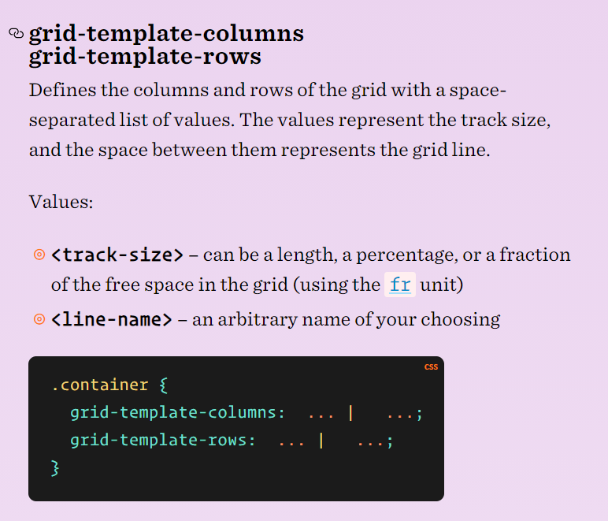
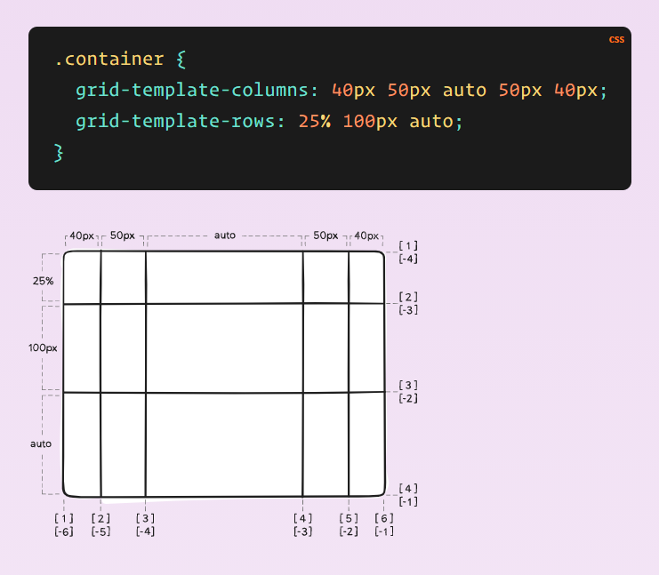
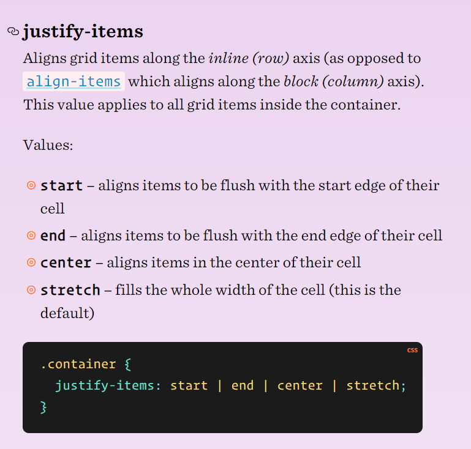
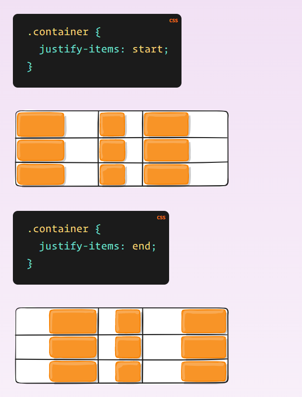

> # Readings: CSS GRID

CSS Grid Layout, is a two-dimensional grid-based layout system that aims to do nothing less than completely change the way we design grid-based user interfaces.

CSS has always been used to lay out our web pages, but it’s never done a very good job of it. First, we used tables, then floats, positioning and inline-block, but all of these methods were essentially hacks and left out a lot of important functionality (vertical centering, for instance).

Flexbox helped out, but it’s intended for simpler one-dimensional layouts, not complex two-dimensional ones.

To get started you have to define a container element as a grid with **display: grid**, set the column and row sizes with **grid-template-columns** and **grid-template-rows**, and then place its child elements into the grid with **grid-column** and **grid-row**. Similarly to **flexbox**, the source order of the grid items doesn’t matter.

In order to stert using Grid we must define grid container 

> # Regex tutorial

Regular expressions (regex or regexp) are extremely useful in extracting information from any text by searching for one or more matches of a specific search pattern (i.e. a specific sequence of ASCII or unicode characters).

`(/^The/g)        matches any string that starts with The`

`(/end$/g)        matches a string that ends with end`

`(/^The end$/g)   exact string match (starts and ends with The end)`

`(/roar/g)        matches any string that has the text roar in it`

> Quantifiers — * + ? and {}

`(/abc*/g)        matches a string that has ab followed by zero or more c`

`(/abc+/g)        matches a string that has ab followed by one or more c`

`(/abc?/g)        matches a string that has ab followed by zero or one c`

`(/abc{2}/g)      matches a string that has ab followed by 2 c`

`(/abc{2,}/)     matches a string that has ab followed by 2 or more c`

`(/abc{2,5}/g)    matches a string that has ab followed by 2 up to 5 c`

`(/a(bc)*/g)      matches a string that has a followed by zero or more copies of the sequence bc`

`(/a(bc){2,5}/g)  matches a string that has a followed by 2 up to 5 copies of the sequence bc`

## Flags

We are learning how to construct a regex but forgetting a fundamental concept: flags.

- g (global) does not return after the first match, restarting the subsequent searches from the end of the previous match.

- m (multi-line) when enabled ^ and $ will match the start and end of a line, instead of the whole string.

- i (insensitive) makes the whole expression case-insensitive (for instance /aBc/i would match AbC).

[Click here to read more](lab02b.md)