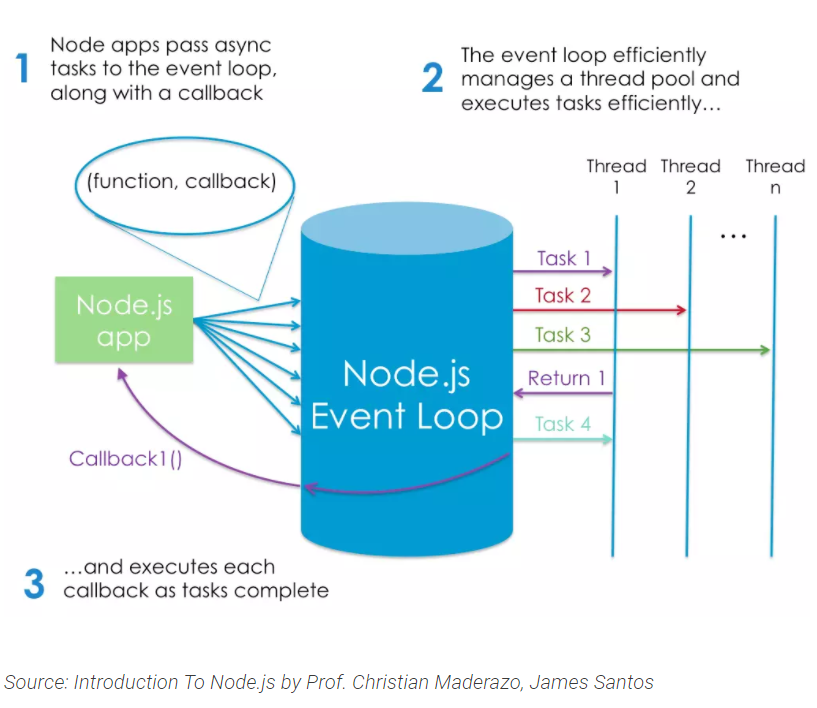

# What Is Node and When Should I Use It?

What Is Node.js?

There are plenty of definitions to be found online. Let’s take a look at a couple of the more popular ones. This is what the project’s home page has to say:

    Node.js® is a JavaScript runtime built on Chrome’s V8 JavaScript engine.

And this is what Stack Overflow has to offer:

    Node.js is an event-based, non-blocking, asynchronous I/O runtime that uses Google’s V8 JavaScript engine and libuv library.

Node Is Built on Google Chrome’s V8 JavaScript Engine. The V8 engine is the open-source JavaScript engine that runs in Google Chrome and other Chromium-based web browsers, including Brave, Opera, and Vivaldi. It was designed with performance in mind and is responsible for compiling JavaScript directly to native machine code that your computer can execute.

However, when we say that Node is built on the V8 engine, we don’t mean that Node programs are executed in a browser. They aren’t. Rather, the creator of Node (Ryan Dahl) took the V8 engine and enhanced it with various features, such as a file system API, an HTTP library, and a number of operating system–related utility methods.

This means that Node.js is a program we can use to execute JavaScript on our computers. In other words, it’s a JavaScript runtime.

> ## How Do I Install Node.js?

Node Binaries vs Version Manager

Many websites will recommend that you head to the official Node download page and grab the Node binaries for your system. 

While that works, I would suggest that you use a version manager instead. This is a program that allows you to install multiple versions of Node and switch between them at will. There are various advantages to using a version manager. 

For example, it negates potential permission issues when using Node with npm and lets you set a Node version on a per-project basis.

“Hello, ASAC World!” the Node.js Way

You can check that Node is installed on your system by opening a terminal and typing `node -v`. If all has gone well, you should see something like v12.20.1 displayed. This is the current LTS version at the time of writing.

Next, create a new file hello.js and copy in the following code:

console.log("Hello, ASAC World!");

This uses Node’s built-in console module to display a message in a terminal window. To run the example, enter the following command:

  `node hello.js`

If Node.js is configured properly, “Hello, ASAC World!” will be displayed.

> npm, the JavaScript Package Manager

Node comes bundled with a package manager called npm. To check which version you have installed on your system, type `npm -v`.

In addition to being the package manager for JavaScript, npm is also the world’s largest software registry. There are over 1,000,000 packages of JavaScript code available to download

Installing a Package Globally
Open your terminal and type the following:

npm install -g jshint
This will install the jshint package globally on your system.

> how we would use npm to install a package.

Installing a Package Globally

Open your terminal and type the following:

`npm install -g jshint`

This will install the jshint package globally on your system.

Installing a Package Locally

`npm init -y`

`npm install lodash --save`

> What Is Node.js Used For?

if you want to start developing apps with any modern JavaScript framework (for example, React or Angular), you’ll be expected to have a working knowledge of Node and npm (or maybe Yarn). This isn’t because you need a Node back end to run these frameworks. You don’t. Rather, it’s because these frameworks (and many, many related packages) are all available via npm and rely on Node to create a sensible development environment in which they can run.

> Node.js Lets Us Run JavaScript on the Server

one of the biggest use cases for Node.js — running JavaScript on the server.

The Node.js Execution Model

What Are the Advantages of Node.js?

1. Your brain no longer needs to switch modes. You can do everything in the same language, which, as a developer, makes you more productive (and hopefully, happier).

1. Speaks JSON. JSON is probably the most important data exchange format on the Web, and the lingua franca for interacting with object databases (such as MongoDB). 

1. JavaScript is ubiquitous: most of us are familiar with JavaScript, or have used it at some point. This means that transitioning to Node development is potentially easier than to other server-side languages.

[Click here to read more](lab02b.md)