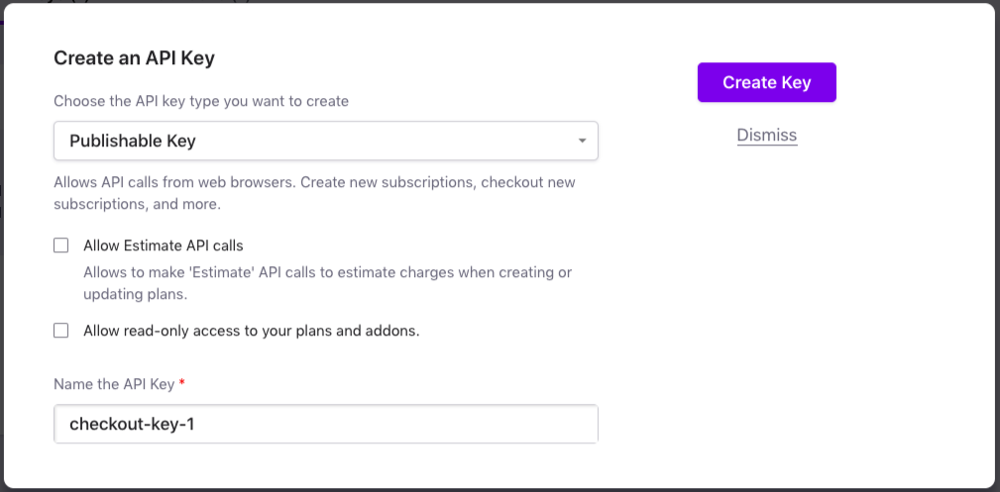

> # API Keys

What is an API key and why it is used?

An application programming interface key (API key) is a unique code that is passed in to an API to identify the calling application or user. API keys are used to track and control how the API is being used, for example to prevent malicious use or abuse of the API.Jun 9, 2020

Understanding API keys - IBM Cloud https://cloud.ibm.com 

What is API key secret?

API keys are supposed to be a secret that only the client and server know. Like Basic authentication, API key-based authentication is only considered secure if used together with other security mechanisms such as HTTPS/SSL.

API Keys - Swagger https://swagger.io 

Why do I need an API key?

API keys identify an application's traffic for the API producer, in case the application developer needs to work with the API producer to debug an issue or show their application's usage. You want to control the number of calls made to your API. You want to identify usage patterns in your API's traffic.

Why and when to use API keys | Cloud Endpoints with OpenAPIhttps://cloud.google.com ›

Example of creating API as bellow:

