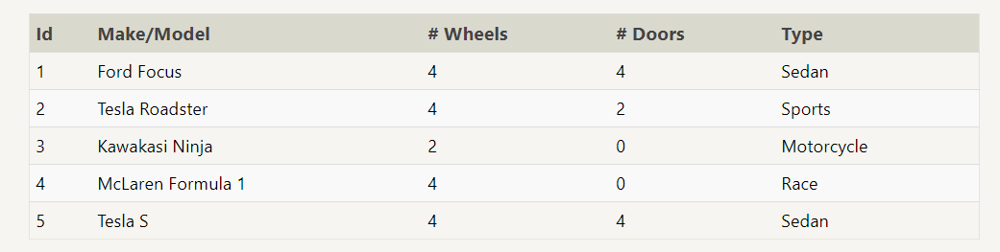
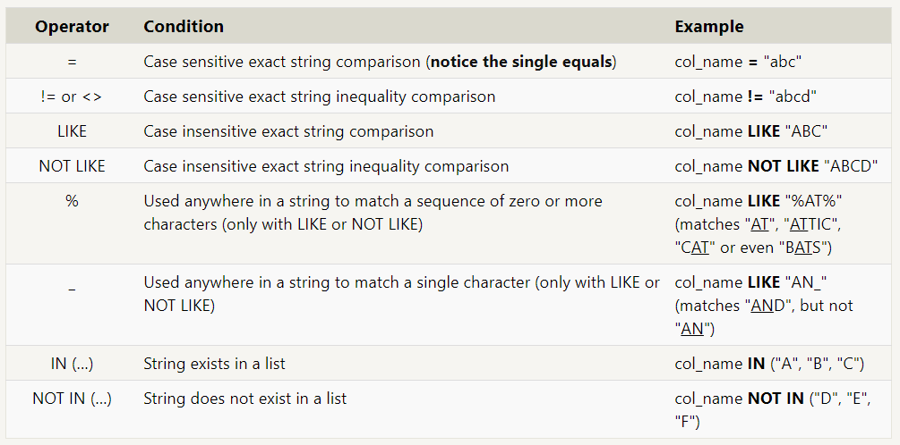

> # Readings: SQL

What is SQL?

Structured Query Language, is a language designed to allow both technical and non-technical users query, manipulate, and transform data from a relational database. And due to its simplicity, SQL databases provide safe and scalable storage for millions of websites and mobile applications.

Relational databases

relational database represents a collection of related (two-dimensional) tables. Each of the tables are similar to an Excel spreadsheet, with a fixed number of named columns (the attributes or properties of the table) and any number of rows of data.

> SELECT queries

To retrieve data from a SQL database, we need to write SELECT statements, which are often colloquially refered to as queries.

     Select query for a specific columns
     SELECT column, another_column, …
     FROM mytable;

    Select query for all columns
    SELECT * 
    FROM mytable;

> Queries with constraints

Now we know how to select for specific columns of data from a table, but if you had a table with a hundred million rows of data, reading through all the rows would be inefficient and perhaps even impossible.

In order to filter certain results from being returned, we need to use a WHERE clause in the query. The clause is applied to each row of data by checking specific column values to determine whether it should be included in the results or not.

    Select query with constraints
    SELECT column, another_column, …
    FROM mytable
    WHERE condition
        AND/OR another_condition
        AND/OR …;

Find the movies released in the years between 2000 and 2010 

`SELECT title FROM movies where year BETWEEN 2000 AND 2010;`

Find the first 5 Pixar movies and their release year

`SELECT title, year FROM movies WHERE year <= 2003;`

>Queries with constraints

When writing WHERE clauses with columns containing text data, SQL supports a number of useful operators to do things like case-insensitive string comparison and wildcard pattern matching. We show a few common text-data specific operators below:

[Click here to read more](lab02b.md)