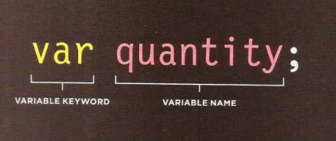
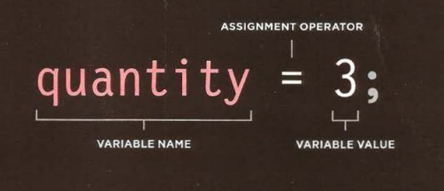

> # Summarization

What we have about Text 
Structural markup: the elements that you can use to describe both headings and paragraphs.

Semantic markup: which provides extra information; such as where emphasis is placed in a sentence, that something you have written is a quotation.

Html has 6 levels of headings

- H1 to H6 the more the number increased the text size get smaller.
- H1 is used for main headings 
- H2 is used for subheadings

To create a paragraph, surround the words that make up the paragraph with an opening tag and closing tag.

> Bold & Italic

By enclosing words in the tags "p"and "/P" we can make characters appear bold.
By enclosing words in the tags "i" and "/i" we can make characters appear italic.

> Superscript & Subscrip

The "sup" element is used to contain characters that should be superscript such as the suffixes of dates or mathematical concepts like raising a number to a power such as 22.

The"sub" element is used to contain characters that should be subscript. It is commonly used with foot notes or chemical formulas such as H20.

> Line Breaks & Horizontal Rules

(br  /)As you have already seen, the browser will automatically show each new paragraph or heading on a new line.

(hr  /)To create a break between themes — such as a change of topic in a book or a new scene in a play — you can add a horizontal rule between sections using the tag.

The element "q" is used for shorter quotes that sit within a paragraph. Browsers are supposed to put quotes around the q element, however Internet Explorer does not — therefore many people avoid using the q element.

> Understanding CSS: Thinking Inside the Box

The key to understanding how CSS works is to imagine that there is an invisible box around every HTML element. So the CSS allow us to edit how this box look like and sure its elements.

> Three ways to style the page using CSS

1-	Inline CSS

The inline style is considered to be not the best because it is the most complicated and hard to apply changes referring to the time and effort that need to applied.

2-	Style CSS

You can also include CSS rules within an HTML page by placing them inside style element of the page.

3-	Using External CSS

“link rel="stylesheet" href="styles.css"”.

>Inheritance in CSS

If you specify the font-family or color properties on the body element, they will apply to most child elements. This is because the value of the font-family property is inherited by child elements. It saves you from having to apply these properties to as many elements (and results in simpler style sheets).

> Color

   How to specify colors

Using color this color property allows you to specify the color of text inside an element. You can specify any color in CSS. 
rgb values (rgb(100,100,90))

- hex codes (#ee3e80)

- color names (DarkCyan)

- background-color

CSS treats each HTML element as if it appears in a box, and the background-color property sets the color of the background for that box.
 
> JavaScript

Each of the lines of code in green is a statement, the pink curly braces indicate the start and end of a code block. (Each code block could contain many more statements.) and the code in purple determines which code should run.

JAVASCRIPT IS CASE SENSITIVE

 JavaScript is case sensitive so hour Now means something different to Hour Now or HOUR NOW.

> COMMENTS

We can assign comment by adding // or /* and we can assign a block for comments more than one line the start of that comment lines will be /* and the end */.

> Adding variables 

Data types in java script first we have number which contains numerical values secondly, we have Boolean which is contain true or false values finally we have string which is contain text or numbers or anything and it will all mean text Value.

 

> Js

We have 2 components to a decision the first one which is an expression is evaluated which we return a value, the second one is a conditional statement says what to do in a given situation.
For comparison D operant does not have to be single value or variable name and operant can be an exception because each expression evaluates into single value.

Finally, we have the if statement which evaluates or checks a condition if the condition evaluates to true any statement in the subsequent code blocks are executed.

Sure we should not forget the else if statement which chicks a condition if it resolves to true the first code block is executed if the condition resolves to false the second code block is run instead.
