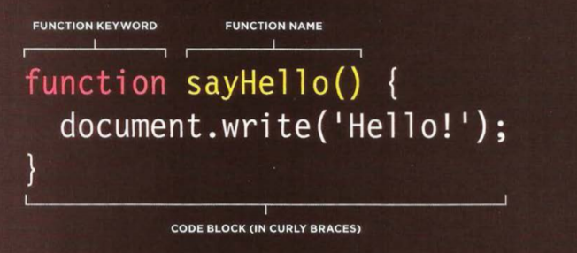

> # Js summarization 

> ## Part 1

The introduction of the book gives us an example to understand the core of javascript  which is the recip example this one gives us how the computer deals with the code.
First we should assign our goal which is what we want, suconly, design the script using the flowchart, after that we need to write full steps to solve the issue to achieve our goal.
Finally we code each step using javascript language.

> ## Part 2 

We have two type of expression :
1- EXPRESSIONS THAT JUST ASSIGN A VALUE TO A VARIABLE 
var name= 'Tareq';
2- EXPRESSIONS THAT USE TWO OR MORE VALUES TO RETURN A SINGLE VALUE
var area = 3 + 2; The value of area is now 5.

Expressions rely on things called operators, JavaScript contains the following mathematical operators, which you can use with numbers.

Syntax | Operator | Description
------------ | ------------- |-------------
ADDITION | + | Adds one value to another
SUBTRACTION | - | Subtracts one value from another
DIVISION | /  | Divides two values
MULTIPLICATION | *   | Multiplies two values using an asterisk
INCREMENT  | ++  | Adds one to the current number
DECREMENT |  - - | Subtracts one from the current number
MODULUS  |  % | Divides two values and returns the remainder

---

> ## part three

**Functions**

Functions let you group a series of statements together to perform a specific task. the response of the fuction is a return value.

> To declear a function as in the photo bellow 

> to call the function 

