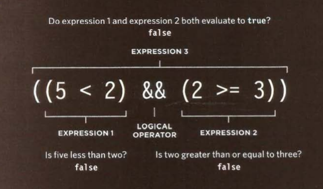

> ## Read 05- Operator and Loops

## Comparison Operators:
Evaluating Condetions

Syntax | Description | Example
------------ | ------------- | -----
== | is equal to | 'hello' == 'good' return False
!= | not equal to |  "hi" != "go" return true
=== | strict equal to | '3' === 3 return False
!== | strict not equal to | '3' !== '3' False
(>) | greater than | 5 > 5 return False
< | less than |  6 < 8 return true
(>= )| greater than or equl to | 3 >= 3 return true
<= | less than or equal | 7 <= 9 Return True

> ## Logecal Operator 

## Comparison Operators

usually Comparison Operators return single value true or false 

it allow you to compare moer than on operator.

Syntax | Description | Example
------------ | ------------- | -----
&& | And logical operator | true && false return False
|| | Or logical operator |  true || false return True
! | Logical Not | !(2>1)  Return True

short cut evaluation 

True || anything => always True

False && anything => Always False

> # Part 2

## Loops

Statements usually have four components: initialization (usually of a loop control variable), continuation test on whether to do another iteration, an update step, and a loop body.

In General loops check conditions the running process keep going while the condtion value is true

### Here we have three type of loops

- For 

  works for a spicfice number of time .

- while

  this one is good if you don't know how many time the code should run.

- Do While 

  the same as while the main differance is that the do-while will run the statment even if the condition was false.

 

